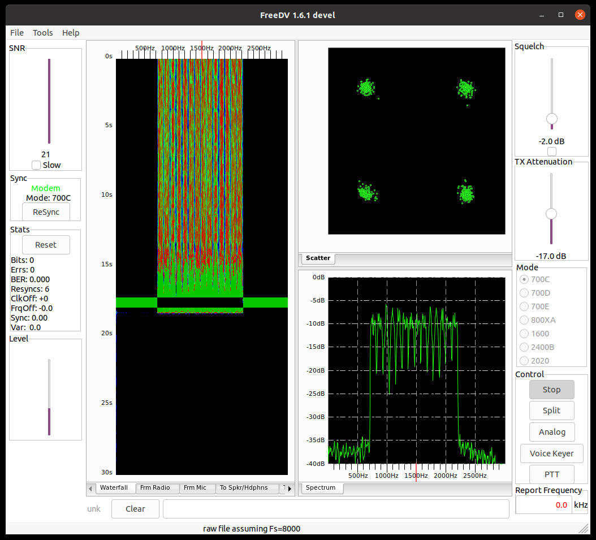

#### Coherent FDM Modem Library
This is a Coherent Phase-Shift Keying (PSK) Frequency-Division Multiplex (FDM) Modem for Digital Voice on HF Radio written as a native Java library.

This waveform was developed for the 700 bit/s vocoder, and does not use bit-level Forward Error Correction (FEC). The modem operates with a symbol rate of 75 Baud, using coherent Quadrature PSK (QPSK) with seven FDM subcarriers. A duplicate group of subcarriers are used for frequency diversity. This diversity is used to combat the effects of fading with shortwave propagation. The modem will still perform well with a ± 40 Hz tuning error.

The original software was developed in Octave, and also translated to C by David Rowe. That software is wrapped in a lot of extra code to make it work with other applications and algorithms in the library. This was then translated to Java. This version broke out only the code fragments directly associated with this particular modem.

The digital voice 700 bit/s vocoder is located in another repository, it requires its companion complex math library source.

The idea was to create a Coherent PSK modem class that was a linkable object library, and the user could then reference the external links in their GUI  or Server application.

Here's a graphic showing the Java modem is compatible with the C++ FreeDV application and the C based cohpsk modem:

One thing to note, this modem is designed to send a continuous stream of data. It is impractical, as designed, to use it to send burst or packet type digital transmissions. The acquisition and timing code would not function correctly.
#### Features
The modem is normally used on HF using the diversity mode. This duplicates the spectrum sending the data twice across the frequency. Thus, if a fade affects one side of the spectrum, it may not affect the other side, and voice decoding is maintained. The diversity is the error correction, so no bit-level FEC is added. It performs suprisingly well. You can also shut off the diversity mode, when the propagation is stable, or for use on VHF and above.

There are seven (7) subcarriers (750 Hz Bandwidth), with fourteen (14) used in diversity mode (1500 Hz Bandwidth). It uses QPSK modulation on each subcarrier.

The API modulator and demodulator transmit and returns complex signals, so if you have a true IQ modulator, and split IQ receive channels, you can transmit or receive the real and imaginary parts on these seperate channels.

#### Theory
The modem sends and receives a row of subcarriers 75 times a second. However, it takes six of these rows to make up a modem frame. First, two pilot reference-phase rows (28 bits), then two speech vocoder rows (28 bits), and finally two more rows for the second speech vocoder frame (28 bits). The process then repeats as long as the transmitter Push-To-Talk (PTT) is keyed.

Thus, a modem frame is 84 bits total. 56 bits are used for speech, and 28 bits are used for the reference-phase pilots. These pilots are what makes this a coherent modem. They are used to correct the received data bit phases. The data rate is 1050 bit/s (75 Baud × 14 bits). The effective data rate is 700 bit/s (75 Baud / 6 or 12.5 Baud × 56 bits). Each row of 14 bits is sent as seven QPSK carriers (2 bits per carrier).

The modem timings are also relevant, in that each speech vocoder frame outputs 28 bits every 40 ms. Since the modem has an 80 ms modem frame, it can transport two speech vocoder frames.

There are 100 complex IQ (In-Phase and Quadrature-Phase) audio samples for each row, at a 7500 Hz rate. 600 samples total for the modem frame. Thus, 100×6 * 12.5 equals the 7500 Hz sample rate. Using a rate conversion filter, the application is provided an 8 kHz interface, which is much more compatible with sound cards. There are 640 complex audio samples at the 8 kHz rate. This rate conversion would not be necessary in firmware.

The modem operates with a center frequency of 1500 Hz. The initial FDM subcarrier frequencies are set using a spreading function. This changes the spacing of each subcarrier a little bit more each subcarrier further to the left. About 105 Hz apart on the right, to about 109 Hz apart on the left. This design, along with spectrum clipping, improves the Peak to Average Power Ratio (PAPR). The measured Crest factor is about 8.3 dB with clipping, and about 10.3 dB without clipping.

The modem waveform consumes a different amount of bandwidth, depending on whether the diversity channel is enabled. About 750 Hz per group of seven subcarriers. Normally you would want to use diversity on shortwave, but optionally on VHF and above.

The ITU emission designation is 1K50J2E for phone type payload.
