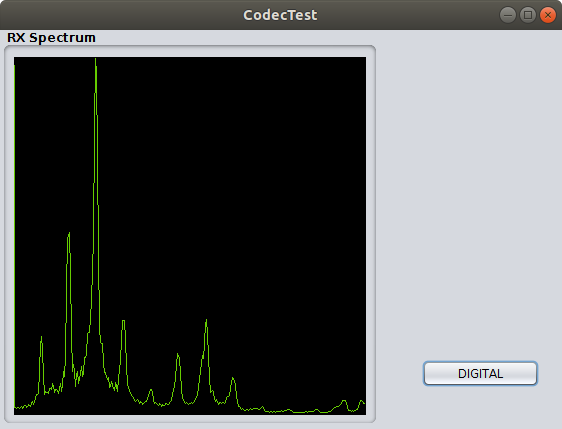
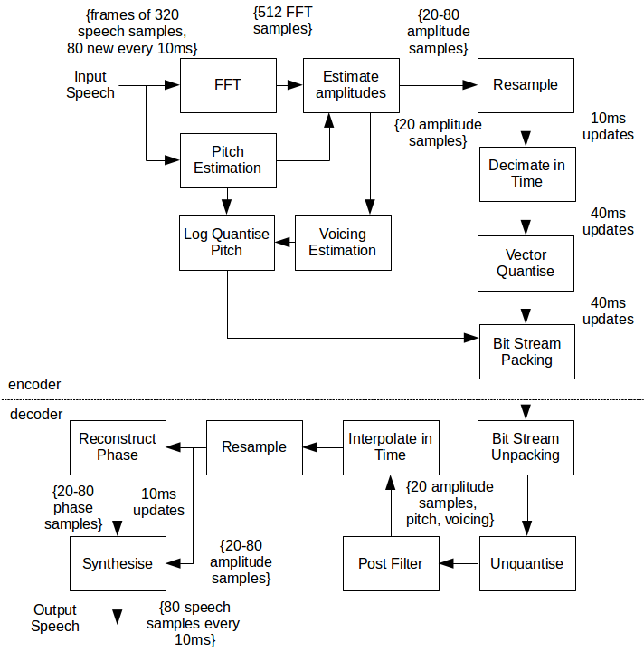

#### A Codec2 Mode 700C Speech Vocoder in Java
This is a translation of the Codec2 700 bit/sec Vocoder into Java.

The Mode 700C Vocoder has a very large codebook, which is greater than Java can handle in a static constant assignment, so the solution was to read in the text files at initialization. This particular vocoder is used in a number of Codec2 modems: OFDM, COFDM, and FSK.

Included is a little testing program CodecTest. It just shows a GUI of the audio spectrum and inputs and outputs audio from your soundcard headset. The output has not been compared with the original.

When you build your application, create a ```lib``` directory and put both the ```javaCodec2.jar``` and ```Complex.jar``` libraries in it.



#### Simplified Theory
The program operates on blocks of PCM audio that is sampled at 8 kHz into 15-bits plus sign. A block of 320 samples (equivalent to 40ms) is then analyzed as four segments of 80 samples (10ms).

These four segments are filtered and converted to the frequency domain, where the pitch and number of harmonics is determined. This information is put into a Encode Model structure.

The model structure is further populated with the harmonic phases and amplitudes, and decides whether the data represents a voiced (vowel sounding) or unvoiced (consonant, quiet, or maybe noise).

The number of harmonics can vary, so they are resampled into a fixed set of 20 harmonics, and these are compared with a codebook of the same number. The index of the values that produce the smallest error is added to the Encode Model. This codebook was developed from many samples of English speaking male and female voices. The codebook is very large, and will consume a good bit of memory.

The Encode Model data is then quantized into a packed bit format and output to the user.

Decoding the packed bits into PCM time samples, uses a similar procedure. In this case, however, four Decode Models are created. One for each 10ms sound segment are synthesized. The quantized voice index is used to get the fixed size 20 harmonics from the codebook, and then using the phase, amplitude, and voicing information, converts that back to a number of harmonics compatible with the original (up to 80). This is then converted back to the time domain and issued out as a block of PCM voice samples.

   

#### Coherent FDM
A Coherent Frequency-Division Multiplex QPSK modem which can use this vocoder codec is also included here in a directory.
#### Note
Software copyrights and license remain with the originators. This is merely a translation put into an Object Oriented form.
